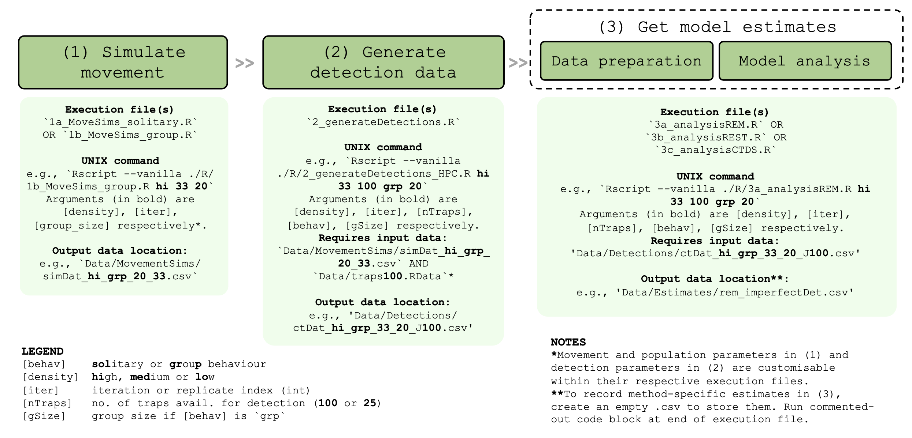

## Overview
This work formed Chapter 4 of my PhD thesis, titled: "Performance of camera trap-based density estimators for unmarked populations".

The aim was to evaluate three commonly used unmarked abundance estimators (REM, REST, CTDS) under a common set of simulations, spanning a wide range of animal population and movement scenarios.

The original papers describing these estimators are as follows:
- Random Encounter Model (REM): https://doi.org/10.1111/j.1365-2664.2008.01473.x
- Random Encounter and Staying Time (REST): https://doi.org/10.1111/1365-2664.13059
- Camera Trap Distance Sampling (CTDS): https://doi.org/10.1111/2041-210X.12790

## Directory structure
The directory should contain the following folders: `R` to contain the R scripts and `Data` to store simulated data. The latter contains subfolders `MovementSims` and `Detections` to store the simulated movement and detection data, and `Estimates` to store the model estimates.

## Running the simulations

The simulation workflow comprises three main steps:
1. **Simulate movement** trajectories for a population of $N$ number of unique inviduals exhibiting either solitary or group-living movement behaviour on a X by X unit landscape.
2. **Generate detection data** from the simulated movement trajectories with a grid of $J$ pie-shaped detectors with detection distance $d$ units and radius $r$ units. Detection probability decreases with distance from the detector.
3. **Get model estimates** by applying an estimator (REM, REST or CTDS) to appropriately formatted input data.

Each step can be run from the command line as shown in the image below:

## Evaluation of model estimates

